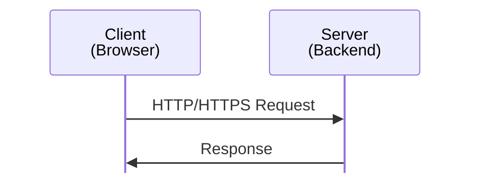
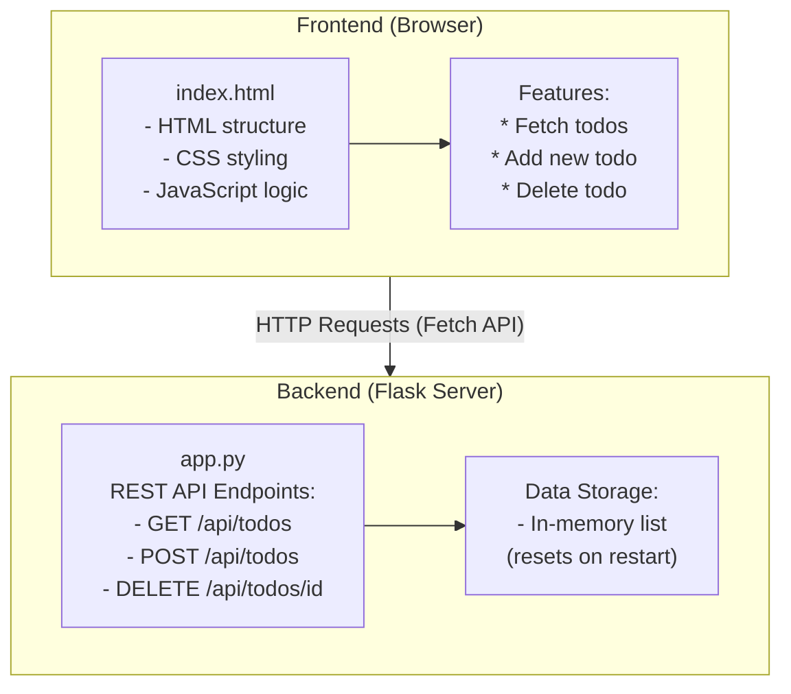
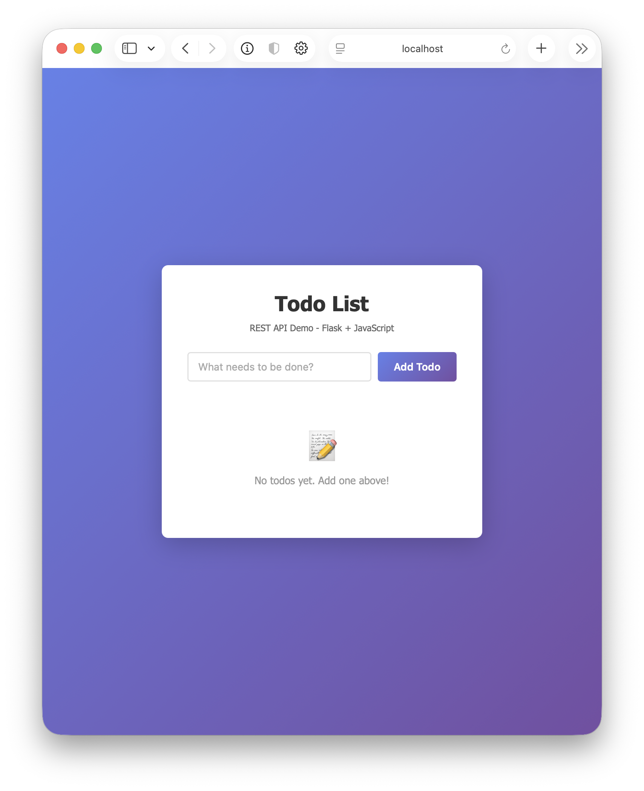
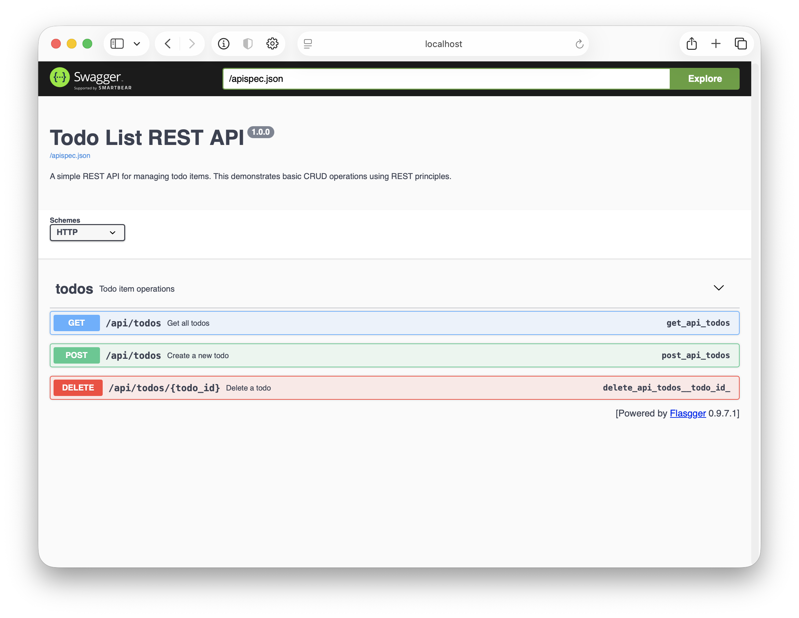

# Tutorial 1: Basic Web Application

This tutorial guide you how to build a simple todo list application demonstrating fundamental web application concepts including REST APIs, client-server architecture, and frontend-backend communication.

> **Note**: This application comes with CORS (Cross-Origin Resource Sharing) pre-configured, so the frontend can communicate with the backend out of the box. Just install dependencies and run!

## Learning Objectives

By completing this tutorial, you will understand:
- How web applications work (client-server architecture)
- The difference between REST and JSON-RPC
- How to build a REST API with Flask (Python)
- How to create a frontend that communicates with a backend
- HTTP methods and their purposes
- JSON data format
- CORS (Cross-Origin Resource Sharing)
- API documentation with Swagger/OpenAPI

---

## Fundamental Concepts

### 1. Client-Server Architecture

A web application typically consists of two parts:



- **Client (Frontend)**: The user interface running in the browser (HTML, CSS, JavaScript)
- **Server (Backend)**: Processes requests, handles business logic, manages data (Python, Node.js, Java, etc.)
- **Communication**: They talk via HTTP protocol using structured messages

### 2. JSON-RPC vs REST

There are different ways for clients and servers to communicate:

#### JSON-RPC (Remote Procedure Call)

**Concept**: RPC-style API where clients invoke server-side methods by name over HTTP.

**Design Philosophy**:
- **Action-oriented**: Focus on operations/methods (verbs) rather than resources (nouns)
- **Single endpoint**: All requests go to one URL (e.g., `/api` or `/rpc`)
- **Method dispatch**: Server routes requests based on the `method` field in the JSON payload
- **Transport-agnostic**: JSON-RPC specification can work over HTTP, WebSockets, TCP, etc.

**Request Format**:
```json
{
  "jsonrpc": "2.0",
  "method": "createTodo",            // Method to invoke
  "params": {"text": "Learn Flask"}, // Method parameters
  "id": 1                            // Request ID for response correlation
}
```

**Response Format**:
```json
{
  "jsonrpc": "2.0",
  "result": {"id": 1, "text": "Learn Flask"},   // Method return value
  "id": 1                                       // Matches request ID
}
```

**Key Characteristics:**
- All operations use POST to a single endpoint
- Method name and parameters are in the request body, not the URL
- Supports request batching (multiple method calls in one HTTP request)
- Stateless protocol with no URL-based resource hierarchy
- Similar in spirit to Java RMI, .NET Remoting, gRPC

**When to use JSON-RPC:**
- Internal microservices communication
- APIs with complex operations that don't map well to CRUD
- When you need request batching
- Examples: Ethereum JSON-RPC API, JSON-RPC for embedded systems

#### REST (Representational State Transfer)
- **Concept**: Treat everything as a "resource" that you can manipulate
- **Style**: Resource-oriented (nouns)
- **Protocol**: Different URLs for different resources
- **Example endpoints**:
  - `GET /todos` - Retrieve todos
  - `POST /todos` - Create a new todo
  - `DELETE /todos/1` - Delete todo with id 1
  - `PUT /todos/1` - Update todo with id 1

**Characteristics:**
- Uses HTTP methods (GET, POST, PUT, DELETE) meaningfully
- URLs represent resources (nouns)
- Stateless - each request contains all needed information
- Think: "What resource am I working with?"
- Used by: Most modern web APIs (GitHub, Twitter, Stripe, etc.)

#### Comparison Example

**Same operation in both styles:**

**JSON-RPC:**
```
POST /api
Body: {"jsonrpc": "2.0", "method": "getTodos", "id": 1}

POST /api
Body: {"jsonrpc": "2.0", "method": "createTodo", "params": {"text": "Learn"}, "id": 2}

POST /api
Body: {"jsonrpc": "2.0", "method": "deleteTodo", "params": {"id": 1}, "id": 3}
```

**REST:**
```
GET /api/todos

POST /api/todos
Body: {"text": "Learn"}

DELETE /api/todos/1
```

**This tutorial uses REST** because it's the most common pattern for modern web APIs and leverages HTTP methods naturally.

### 3. HTTP Methods

REST APIs use different HTTP methods to indicate the type of operation:

| Method   | Purpose                | Example                    | Idempotent* |
|----------|------------------------|----------------------------|-------------|
| `GET`    | Retrieve data          | Get list of todos          | Yes         |
| `POST`   | Create new resource    | Create a new todo          | No          |
| `PUT`    | Update/replace resource| Update an existing todo    | Yes         |
| `DELETE` | Remove resource        | Delete a todo              | Yes         |

*Idempotent: Calling it multiple times has the same effect as calling it once

### 4. JSON Data Format

Web APIs typically exchange data in JSON (JavaScript Object Notation):

```json
{
  "id": 1,
  "text": "Learn Flask",
  "completed": false
}
```

**Why JSON?**
- Human-readable
- Easy to parse in any programming language
- Native support in JavaScript
- Lightweight compared to XML

### 5. CORS (Cross-Origin Resource Sharing)

**CORS** is a browser security mechanism that controls cross-origin HTTP requests initiated by JavaScript. An **origin** is defined by the tuple (protocol, domain, port). Different origins include:
- `http://localhost:8080` (frontend)
- `http://localhost:8000` (backend)
- `https://example.com`

**Same-Origin Policy (SOP)**: By default, browsers block JavaScript from reading responses from different origins. This prevents malicious sites (e.g., `evil.com`) from making AJAX requests to other sites and stealing data or performing unauthorized actions (CSRF attacks).

**CSRF (Cross-Site Request Forgery)**: A malicious site tricks the browser into sending authenticated requests to another site. Example: `evil.com` contains `<form action="https://mybank.com/transfer">` which auto-submits, causing unauthorized transfers using your session cookies.

**Why SOP helps but isn't enough:**
- `evil.com` **CAN** trigger requests to `mybank.com` (via forms, images)
- `evil.com` **CANNOT** read responses via JavaScript (SOP blocks this)
- This limits data theft but doesn't prevent state-changing operations

**CSRF Prevention**: CSRF tokens, SameSite cookies, Origin header validation, custom headers requirement.

**SOP vs CORS**: SOP blocks cross-origin access by default. CORS allows servers to selectively permit specific origins.

**Why this our needs CORS:**
- Frontend: `http://localhost:8080`, Backend: `http://localhost:8000` → Different origins
- Without CORS: Browser blocks JavaScript from reading API responses

**CORS Implementation:**

**Server (Flask)** adds headers indicating allowed origins:
```python
from flask_cors import CORS
CORS(app, resources={
    r"/api/*": {
        "origins": "*",  # Development: allow all. Production: specific domains only
        "methods": ["GET", "POST", "DELETE", "OPTIONS"],
        "allow_headers": ["Content-Type"]
    }
})
```

### 6. API Documentation with Swagger/OpenAPI

**Why API documentation matters:**
- Helps developers understand how to use your API
- Provides interactive testing without writing code
- Documents request/response formats and data types
- Serves as a contract between frontend and backend teams

**OpenAPI Specification (formerly Swagger)** is the industry standard for documenting REST APIs. It provides:
- Machine-readable API descriptions (JSON/YAML format)
- Auto-generated interactive documentation (Swagger UI)
- Code generation tools for clients and servers
- Validation and testing capabilities

**In this tutorial:**
- We use `flasgger` library to add Swagger UI to Flask
- API documentation is written as YAML in function docstrings
- Swagger UI provides a web interface at `/api-docs`
- You can test all endpoints directly from the browser

**Example OpenAPI documentation:**
```yaml
---
tags:
  - todos
parameters:
  - in: body
    name: body
    schema:
      type: object
      properties:
        text:
          type: string
```

---

## Application Architecture

Our simple todo list application:



**Data Flow Example - Adding a Todo:**

1. User types "Learn Flask" and clicks "Add"
2. JavaScript captures the event
3. JavaScript sends: `POST /api/todos` with body `{"text": "Learn Flask"}`
4. Flask receives request, creates todo with unique ID
5. Flask responds: `{"id": 1, "text": "Learn Flask"}`
6. JavaScript receives response, updates the page

---

## Project Structure

```
1-basic-webapp/
├── README.md              # This file
├── start.sh              # Quick startup script
├── backend/
│   ├── app.py            # Flask server (REST API)
│   └── requirements.txt  # Python dependencies
└── frontend/
    └── index.html        # Complete frontend (HTML + CSS + JS)
```

---

## Prerequisites

- Python 3.7 or higher
- pip (Python package manager)
- A web browser
- A text editor

---

## Quick Start

#### Step 1: Set Up and Run the Backend

```bash
# Navigate to backend directory
cd backend

# Install dependencies (first time only)
python3 -m pip install -r requirements.txt

# Run the Flask server
python3 app.py
```

You should see:
```
Starting Flask server...
API will be available at: http://127.0.0.1:5000
```

The backend is now running! Keep this terminal open.

#### Step 2: Serve the Frontend from an HTTP Server

**Recommended method** - Use a local HTTP server:

```bash
# Open new terminal
cd frontend

# Python 3 - starts HTTP server on port 8080
python3 -m http.server 8080

# Then visit http://localhost:8080 in your browser
```

This runs a simple HTTP server that serves your frontend files. Your browser will load `index.html` from `http://localhost:8080`, which then makes requests to the backend API at `http://localhost:5000`.

**Alternative** - Open the file directly (may have limitations):
- You can also open `frontend/index.html` directly in your browser (using `file://` protocol)
- This works for this simple tutorial, but using an HTTP server is the proper way and more closely mimics real-world deployments



---

## Swagger API Documentation

This tutorial includes **Swagger UI** (also known as OpenAPI) - an interactive API documentation tool that lets you explore and test your API directly from your browser.

### What is Swagger/OpenAPI?

**Swagger** (now called OpenAPI Specification) is a standard way to document REST APIs. It provides:
- **Interactive documentation**: See all available endpoints, their parameters, and response formats
- **Try it out**: Test API endpoints directly from the browser without writing code
- **Schema validation**: Understand the expected request/response structure
- **Industry standard**: Used by companies like Google, Microsoft, Stripe, etc.

### Accessing Swagger UI

Once your backend is running, open:
```
http://localhost:8000/api-docs
```

You'll see an interactive interface showing all your API endpoints.



### Using Swagger UI

1. **Explore endpoints**: Click on any endpoint (GET, POST, DELETE) to expand it
2. **See details**: View parameters, request body schema, and possible responses
3. **Try it out**:
   - Click the "Try it out" button
   - Fill in any required parameters or request body
   - Click "Execute" to send a real request to your API
   - See the actual response below
4. **View examples**: Each endpoint shows example requests and responses

**Example - Creating a todo via Swagger:**
1. Open `http://localhost:8000/api-docs`
2. Find the `POST /api/todos` endpoint and click it
3. Click "Try it out"
4. Edit the request body JSON:
   ```json
   {
     "text": "Learn Swagger"
   }
   ```
5. Click "Execute"
6. See the response with the created todo including its assigned ID

This is a great way to test your API without needing to use the frontend or write curl commands!

---

## Test the Application

1. **Add a todo**: Type something in the input box and click "Add Todo"
2. **View todos**: Your todos appear in a list below
3. **Delete a todo**: Click the "Delete" button next to any todo
4. **Check the API directly**:
   - Raw JSON: `http://localhost:8000/api/todos`
   - Swagger UI: `http://localhost:8000/api-docs` (interactive testing)

### Debugging Tip

**Open the browser developer console** to see network requests, JavaScript errors, and CORS issues:

- **Chrome**: Press `F12` or `Cmd+Option+J` (Mac) / `Ctrl+Shift+J` (Windows/Linux)
- **Safari**: Enable Developer menu in Preferences → Advanced, then press `Cmd+Option+C`
- **Firefox**: Press `F12` or `Cmd+Option+K` (Mac) / `Ctrl+Shift+K` (Windows/Linux)

In the console, you can:
- View **Network** tab to see HTTP requests/responses and status codes
- View **Console** tab to see JavaScript errors and `console.log()` output
- Inspect CORS errors and other API issues

---

## How It Works

### Backend (Flask) - `backend/app.py`

The Flask server provides three endpoints:

**1. GET /api/todos - Retrieve all todos**
```python
@app.route('/api/todos', methods=['GET'])
def get_todos():
    return jsonify(todos)
```
- Returns the entire list of todos as JSON

**2. POST /api/todos - Create a new todo**
```python
@app.route('/api/todos', methods=['POST'])
def create_todo():
    data = request.json
    new_todo = {
        'id': len(todos) + 1,
        'text': data['text']
    }
    todos.append(new_todo)
    return jsonify(new_todo), 201
```
- Receives JSON data from the client
- Creates a new todo with a unique ID
- Adds it to the list
- Returns the created todo with status code 201 (Created)

**3. DELETE /api/todos/<id> - Delete a todo**
```python
@app.route('/api/todos/<int:todo_id>', methods=['DELETE'])
def delete_todo(todo_id):
    global todos
    todos = [t for t in todos if t['id'] != todo_id]
    return '', 204
```
- Filters out the todo with the specified ID
- Returns empty response with status code 204 (No Content)

### Frontend (JavaScript) - `frontend/index.html`

The JavaScript code uses the **Fetch API** to communicate with the backend:

**Fetching todos:**
```javascript
fetch('http://localhost:5000/api/todos')
    .then(response => response.json())
    .then(data => {
        // Update the UI with the todos
    });
```

**Creating a todo:**
```javascript
fetch('http://localhost:5000/api/todos', {
    method: 'POST',
    headers: {
        'Content-Type': 'application/json'
    },
    body: JSON.stringify({ text: todoText })
})
```

**Deleting a todo:**
```javascript
fetch(`http://localhost:5000/api/todos/${todoId}`, {
    method: 'DELETE'
})
```

---

## Understanding the Code

### Key Concepts in `app.py`:

1. **Flask initialization**:
   ```python
   from flask import Flask, request, jsonify
   from flask_cors import CORS

   app = Flask(__name__)
   CORS(app)  # Enable CORS for all routes - allows frontend on different origin to access API
   ```
   - `Flask(__name__)`: Creates the Flask application
   - `CORS(app)`: Enables Cross-Origin Resource Sharing - crucial for allowing your frontend (on one port) to communicate with your backend (on another port)

2. **Route decorators**: `@app.route('/path', methods=['GET', 'POST'])`
   - Define URL endpoints
   - Specify which HTTP methods are allowed

3. **Request handling**: `request.json`
   - Access data sent by the client

4. **Response formatting**: `jsonify(data)`
   - Convert Python dictionaries/lists to JSON
   - Sets proper `Content-Type: application/json` headers

5. **In-memory storage**: `todos = []`
   - Simple list to store data
   - Data is lost when server restarts
   - In real apps, you'd use a database

### Key Concepts in `index.html`:

1. **DOM manipulation**:
   ```javascript
   document.getElementById('todoInput')
   ```

2. **Event listeners**:
   ```javascript
   form.addEventListener('submit', handleSubmit)
   ```

3. **Fetch API** - Modern way to make HTTP requests:
   ```javascript
   fetch(url, options)
       .then(response => response.json())
       .then(data => { /* use data */ })
   ```

4. **Async operations** - Web requests are asynchronous:
   - Promises (`.then()` chains)
   - Request is sent, code continues
   - When response arrives, callback is executed

---

## Common Issues and Solutions

### Issue 1: CORS Error
**Error**: "Access to fetch has been blocked by CORS policy"

**Cause**: The browser blocks requests from the frontend to the backend because they're on different origins (different ports/domains).

**Solution**: This app already has Flask-CORS configured! Make sure:
1. Flask-CORS is installed: `python3 -m pip install -r requirements.txt`
2. The backend server is running: `python3 app.py`

The code already includes:
```python
from flask_cors import CORS
CORS(app)  # This allows cross-origin requests
```

### Issue 2: Connection Refused / Failed to Fetch
**Error**: "Failed to fetch" or "Connection refused"

**Solution**:
- Ensure Flask server is running on port 8000 (`python3 app.py` in backend directory)
- Check that the backend URL in `frontend/index.html` is correct:
  ```javascript
  const API_URL = 'http://localhost:8000/api/todos';
  ```
- Try accessing `http://localhost:8000` directly in your browser to verify the server is running

### Issue 3: Port Already in Use
**Error**: "Address already in use"

**Cause**: Another application is already using port 8000. (Note: On macOS, port 5000 is used by AirPlay Receiver, which is why we use 8000 instead)

**Solution**:
If you encounter port conflicts on port 8000:

```bash
# On macOS/Linux - Find process using port 8000
lsof -i :8000
# Kill the process
kill -9 <PID>

# On Windows
netstat -ano | findstr :8000
taskkill /PID <PID> /F
```

Or change to a different port in `backend/app.py`:
```python
app.run(debug=True, port=8001)  # Change to any available port
```

Then update the frontend `API_URL` to match:
```javascript
const API_URL = 'http://localhost:8001/api/todos';  // Update port
```

### Issue 4: Module Not Found Error
**Error**: "ModuleNotFoundError: No module named 'flask'" or "No module named 'flask_cors'"

**Solution**:
```bash
cd backend
python3 -m pip install -r requirements.txt
```

## Next Steps

After completing this tutorial:

1. **Add a database**: Replace in-memory list with PostgreSQL (see Tutorial 8)
2. **Containerize with Docker**: Package your app in containers (Tutorial 2)
3. **Learn about databases**: Understand different database types (Tutorial 3)
4. **Deploy to Kubernetes**: Learn orchestration (Tutorials 4-5)
5. **Add authentication**: Protect your API with user login
6. **Build a more complex app**: User accounts, multiple resources, relationships

---

## Additional Resources

- [Flask Documentation](https://flask.palletsprojects.com/)
- [MDN Web Docs - Fetch API](https://developer.mozilla.org/en-US/docs/Web/API/Fetch_API)
- [REST API Tutorial](https://restfulapi.net/)
- [HTTP Status Codes](https://developer.mozilla.org/en-US/docs/Web/HTTP/Status)
- [OpenAPI Specification](https://swagger.io/specification/)
- [Flasgger Documentation](https://github.com/flasgger/flasgger)
